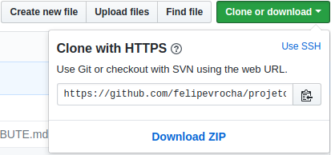
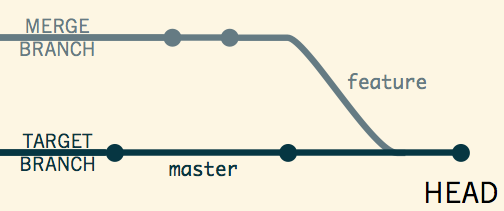
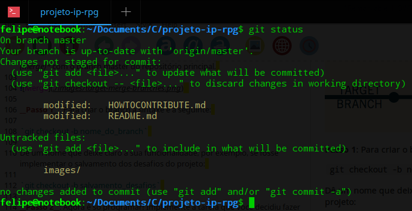
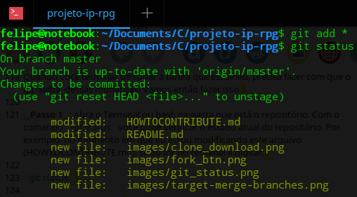
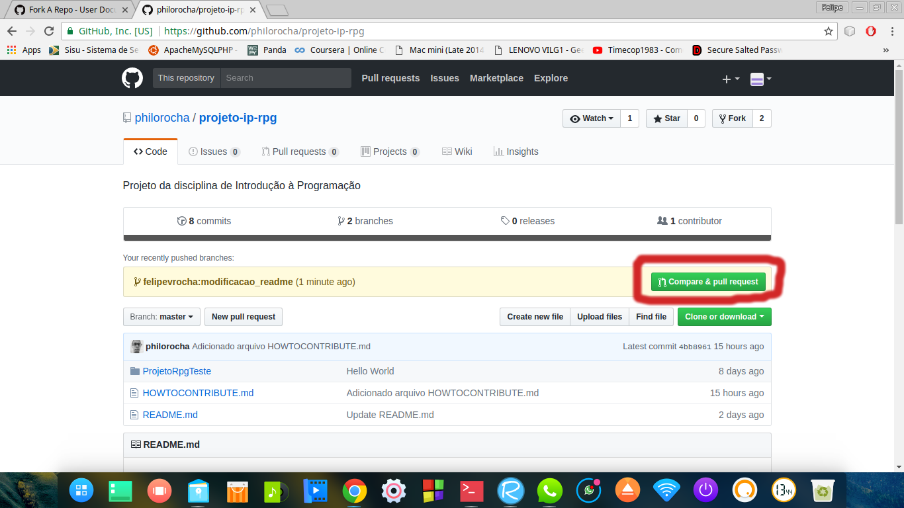
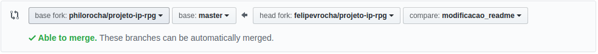
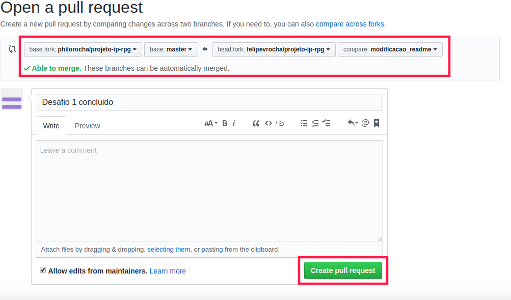

## Como colaborar com o projeto

__1. Faça sua conta no [Github](https://github.com/). Após isso confirme seu endereço de e-mail.__  
__2. Instalar e configurar o Git__  
2.1 Baixe e instale o [Git](https://git-scm.com/)  
2.2 Configurar o __Git__  
  * Abra o __Terminal (Linux)__ ou __Clique Direito na Área de Trabalho -> Git Bash Here (Windows)__  
   * Digite o comando para configurar o endereço de e-mail:  
    `git config --global user.email "seuemail@mail.com"`  
    substitua o endereço de e-mail pelo o que você cadastrou na conta do Github.
   * Em seguida, vamos configurar o nome do usuário com o comando:  
    `git config --global user.name "Seu Nome Aqui"`  
    substitua preferencialmente por seu nome completo.  
    * Por fim, para verificar se as configurações foram salvas digite:  
      `git config --list`  
      Deverá aparecer algo como:  
      `user.name=Seu Nome Aqui`  
     `user.email=seuemail@mail.com`  
     * Se tudo for exibido corretamente, o Git está configurado. Caso contrário execute os comandos novamente para corrigir algum erro.  
     
__3. Fazendo fork do projeto__  
Um fork é uma cópia de um repositório, fazer o fork de um repositório permite você fazer alterações sem afetar o projeto original.  
3.1 Como fazer um fork do projeto?  

   * Vá até a página do projeto [RU GO!](https://github.com/philorocha/projeto-ip-rpg)  
   
    * No canto superior direito da página clique no botão __*fork*__ , após isso será feita uma cópia do repositório do projeto para sua conta do GitHub.  
    
    * Nesse momento você já tem uma cópia (fork) do projeto, mas esta cópia ainda não está no seu computador. Vamos fazer um clone do seu fork localmente no seu computador.  
    
        __Passo 1__: No GitHub navegue até seu fork do projeto-ip-rpg. Deve estar localizado no endereço `https://github.com/SEU_USUARIO_GITHUB/projeto-ip-rpg`  
        
        __Passo 2__: Nesta página terá um botão verde escrito __Clone or Download__, clique nele e __copie__ o endereço (algo como `https://github.com/SEU_USUARIO_GITHUB/projeto-ip-rpg.git`)  
        
        
        
        __Passo 3__: Vá até uma pasta onde você deseja guardar o projeto e abra o __Terminal (Linux)__ ou __Clique Direito -> Git Bash Here (Windows)__, em seguida digite o seguinte comando para fazer o download do repositório (clone):  
        `git clone https://github.com/SEUNOMEDEUSUARIO/projeto-ip-rpg.git`  
Subistitua a URL pelo endereço que você copiou no Passo 2.  
        
Depois disso você já terá uma cópia do seu fork do repositório projeto-ip-rpg em seu computador!  
        
__4. Configurando Git para sincronizar seu fork com o repositório original projeto-ip-rpg__  

Quando você faz um fork do projeto, para propor mudanças no repositório original você pode configurar o Git para puxar (pull) as atualizações do original, também chamado de upstream, que é o repositório que você fez o fork.  

__Passo 1__: Na pasta onde está o repositório abra o terminal ou o git bash e digite `git remote -v` e tecle __Enter__. Você verá os repositórios remotos configurados para o seu fork.  
`$ git remote -v`  
`origin  https://github.com/YOUR_USERNAME/YOUR_FORK.git (fetch)`  
`origin  https://github.com/YOUR_USERNAME/YOUR_FORK.git (push)`  

__Passo 2__: Digite `git remote add upstream` e a url do projeto original `https://github.com/philorocha/projeto-ip-rpg.git` e tecle __Enter__, ficará assim:  

`git remote add upstream https://github.com/philorocha/projeto-ip-rpg.git`  

Se você executar mais uma vez o comando `git remote -v` verá a URL para seu fork como `origin` e para o repositório original como `upstream`.  

Exemplo de saída:  
`$ git remote -v`  
`origin    https://github.com/YOUR_USERNAME/YOUR_FORK.git (fetch)`  
`origin    https://github.com/YOUR_USERNAME/YOUR_FORK.git (push)`  
`upstream  https://github.com/ORIGINAL_OWNER/ORIGINAL_REPOSITORY.git (fetch)`  
`upstream  https://github.com/ORIGINAL_OWNER/ORIGINAL_REPOSITORY.git (push)`  

Agora, você pode manter seu fork sincronizado com o repositório original com poucos comandos git (Veremos na próxima seção como fazer isso)  

__5.Sincronizando um fork__  

Sincronizar um fork faz com que ele esteja atualizado com o repositório original  

5.1. Certifique-se que está na pasta do projeto  
5.2. Abra o __Terminal (Linux)__ ou o __git bash (Windows)__ dentro dessa pasta.  
5.3. Execute o seguinte comando para trazer as atualizações do repositório original:  
`git fetch upstream`  
A saída será algo parecido com:  
`$ git fetch upstream`  
`remote: Counting objects: 75, done.`  
`remote: Compressing objects: 100% (53/53), done.`  
`remote: Total 62 (delta 27), reused 44 (delta 9)`  
`Unpacking objects: 100% (62/62), done.`  
`From https://github.com/ORIGINAL_OWNER/ORIGINAL_REPOSITORY`  
`* [new branch]      master     -> upstream/master`  

5.4. Mude para o branch (ramo) local `master`:  
`git checkout master`  
A saída será:  
`$ git checkout master`  
`Switched to branch 'master'`  

5.5. Agora para mesclar (merge) as alterações do repositório original (upstream) com seu repositório local no branch (ramo) `master` execute o comando:  
`git merge upstream/master`  

Ao fazer isso, seu repositório local será atualizado com as modificações (se houve alguma) do repositório original do projeto.  

## Mãos na massa! Ou melhor, no código :laughing:

Como você já tem uma cópia do seu fork em seu computador, já pode começar a implementar as tarefas listadas do [README.md](https://github.com/philorocha/projeto-ip-rpg/blob/master/README.md)  

### Como faço para implementar e enviar meu código para o repositório?  

O primeiro passo é você criar um novo branch (ramo) que conterá o código que você irá implementar. No seu repositório existe o branch `master` que contém todo código estável do projeto. Para adicionar uma *nova funcionalidade* ao projeto você deve criar esse *novo branch* que será posteriormente *mesclado (merge)* com o branch master do repositório principal.  

   

#### Criando um branch  

__Passo 1__: Para criar o branch a sintaxe é a seguinte:  

`git checkout -b nome_do_branch`  

Dê um nome que deixe claro a sua funcionalidade, por exemplo, se fosse implementar o salvamento dos desafios do projeto:  

`git checkout -b salvamento_desafios`  

__Passo 2__: Agora é só programar! Implemente a tarefa que você decidiu fazer até que esteja tudo pronto. :computer:  

###Terminei de codificar, e agora?  

Quando você terminar de codar a tarefa que escolheu, precisa fazer com que o git 'saiba' dessas mudanças. Vamos então fazer isso.  

__Passo 1__: Abra o Terminal ou bash na pasta que está o repositório. Com o comando `git status` você pode verificar o estado atual do repositório. Por exemplo, no momento em que eu estou modificando este arquivo (HOWTOCONTRIBUTE.md), se eu for no terminal e digitar:  

`git status`  

Será exibido algo assim:  

  

Eu fiz modificações nos arquivos `HOWTOCONTRIBUTE.md` e `README.md` e também criei uma pasta `images` e adicionei alguns arquivos dentro dela. Para que minhas modificações sejam *adicionadas* e posteriormente *confirmadas* no meu repositório *local*, eu preciso executar os seguintes comandos:  

__Adicionando modificações para Commit__:  

`git add <nome_do_arquivo>`para especificar o arquivo que deseja adicionar  

ou  

`git add *` para adicionar todos os arquivos  

Após fazer isso e executar novamente `git status`, podemos ver quais modificações serão *confirmadas* (serão gravadas no repositório local):  

  

__Confirmando modificações com git commit__:  

Agora confirmamos as modificações com o comando:  

`git commit -m "Melhoria na lista de tarefas e atualização do guia"`  

Na mensagem de commit (que está entre aspas) procure deixar claro exatamente o que você fez :thumbsup:  

Tudo certo! Agora é só enviar seu trabalho para o fork no GitHub!  

`git push origin <nome_do_seu_branch>`  

Substitua pelo nome do branch que você criou, se você não lembrar o nome do branch, digite `git branch` para ver a lista de branchs.  

### Quase lá!

Agora você precisa fazer o *pull request* no repositório original, que nada mais é que você mandar as modificações que você fez para que elas possam ser *mescladas (merge)* com o branch master do repositório original. Então vamos lá!  

__Passo 1__: Acesse a página do repositório original:  

[https://github.com/philorocha/projeto-ip-rpg](https://github.com/philorocha/projeto-ip-rpg)  

Você verá algo parecido com isso:  

  

Clique em __Compare & pull request__  

__Passo 2__: Na janela seguinte, verifique se o __fork base__ e o __branch master__ são `philorocha/projeto-ip-rpg` e `master` respectivamente (Lado esquerdo da imagem). No lado direito deve estar o __seu fork__ e __seu branch__ respectivamente, no meu caso são `felipevrocha/projeto-ip-rpg` e `modificacao_readme`.   

  

Depois disso basta clicar em __Create pull request__ e pronto! Você enviou suas modificações para o repositório original. Caso esteja tudo certo, o proprietário do repositório irá confirmar e mesclar suas alterações com o repositório original! :fireworks: :fireworks: :fireworks:  

  
